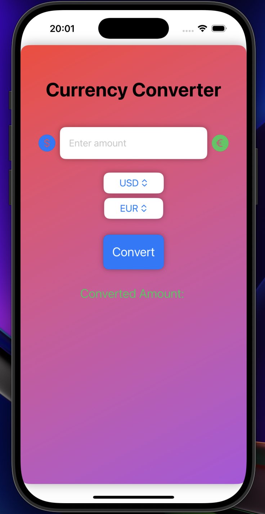
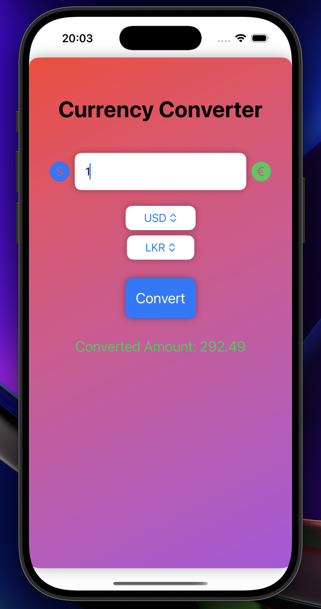
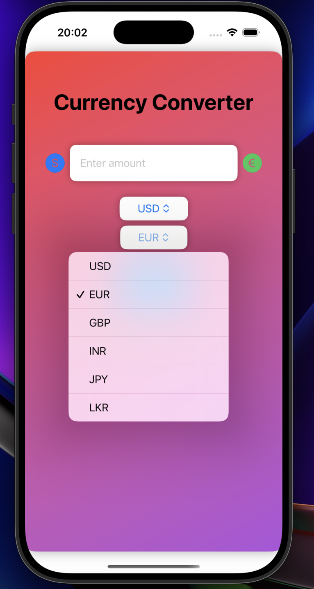

# 🌍 Currency Converter App

## ✨ Description

The **Currency Converter App** is an intuitive iOS application designed to convert currencies quickly and seamlessly. With support for live exchange rates, attractive icons, smooth animations, and a dynamic gradient background, this app offers a clean and engaging user experience.

The app is optimized for both 🌞 **light** and 🌙 **dark modes**, ensuring a modern and visually appealing interface across all devices.

---

## 🌟 Features

1. **💱 Real-Time Currency Conversion**  
   - Convert between popular currencies such as USD, EUR, GBP, INR, JPY, and LKR.  
   - Fetches live exchange rates dynamically.

2. **🎨 Stunning Animations**  
   - Animated transitions for buttons, results, and loading spinners.  
   - Fade-in effects when the conversion result is displayed.

3. **🖼️ Beautiful Currency Icons**  
   - Uses visually appealing icons for currencies like USD ($), EUR (€), and LKR (රු).  

4. **🌈 Dynamic Gradient Background**  
   - Soft gradient colors that adapt perfectly to the app’s theme.

5. **🌗 Light & Dark Mode Support**  
   - Automatic adjustment for light and dark modes for optimal readability and user experience.

6. **⚡ Loading Spinner**  
   - A modern loading spinner displayed during the conversion process.

---

## 🔧 Requirements

- **📱 iOS Version**: 15.0+  
- **🖥️ Xcode Version**: 14.0+  
- **🛠️ Swift Version**: 5.6+  

---

## 🚀 Installation

1. **Clone the repository**:  
   ```bash
   git clone https://github.com/your-repo/currency-converter-app.git
   ```

2. **Open the project in Xcode**:  
   ```bash
   cd currency-converter-app
   open CurrencyConverter.xcodeproj
   ```

3. **Run the app on a simulator or device**:  
   Select your target device and click the **Run** button.

---

## 📸 Screenshots

### 1.  MainMenu  


### 2. Converter


### 3. Selection


---

## 🌈 App Highlights

### **Live Exchange Rates**  
Get real-time conversion rates from popular APIs like ExchangeRate-API.

### **Animated Results**  
Experience smooth fade-in animations for conversion results.

### **User-Friendly Interface**  
Simple and clean UI designed for ease of use.

### **Dynamic Currency Icons**  
Visually enriched with currency-specific icons.

---

## ⚙️ Customization

### How to Add New Currencies  
1. Add the new currency code to the `currencies` array:
   ```swift
   let currencies = ["USD", "EUR", "GBP", "INR", "JPY", "LKR", "YOUR_CURRENCY_CODE"]
   ```

2. Update the API logic to handle the new currency.

---

## 🖼️ Animation Showcase

**1. Convert Button Animation**  
- A responsive and smooth animation on button press.

**2. Loading Spinner**  
- Engaging spinner animation while fetching exchange rates.

**3. Fade-In Result Animation**  
- Smooth fade-in transition for the converted amount display.

---

## 💻 Contribution

If you'd like to contribute to this project:  
1. Fork the repository.  
2. Create a new branch for your feature.  
3. Make your changes and commit them.  
4. Open a pull request with a detailed explanation of your feature.

---

## 📄 License

This project is licensed under the **MIT License**. See the [LICENSE](Apptora) file for details.

---
